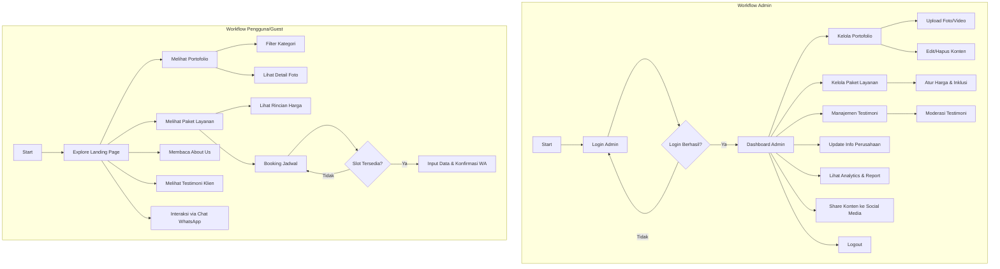
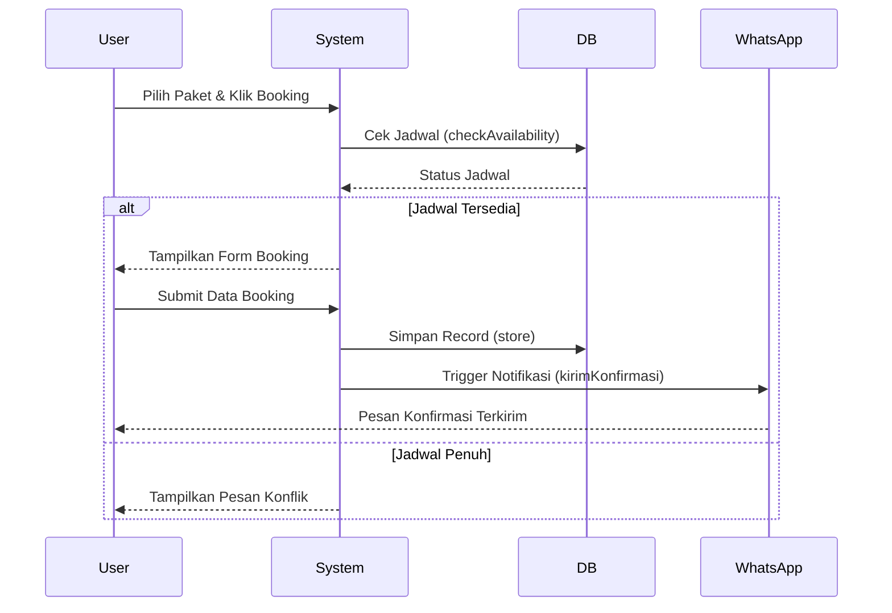
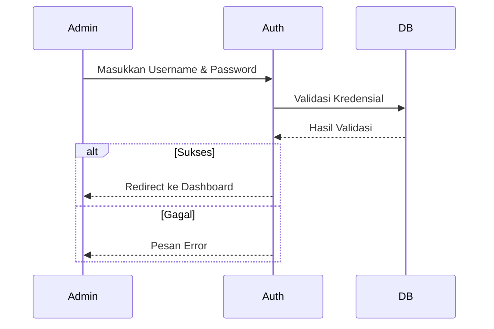
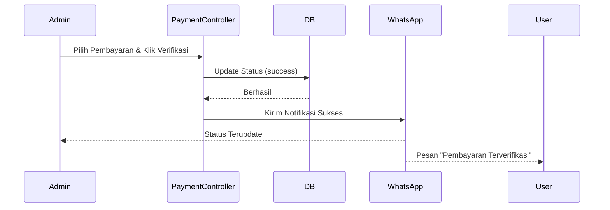
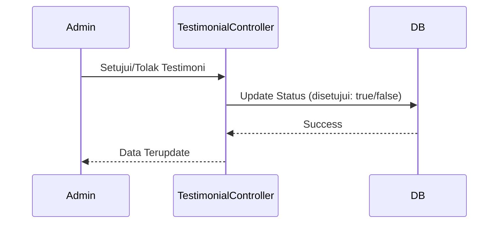
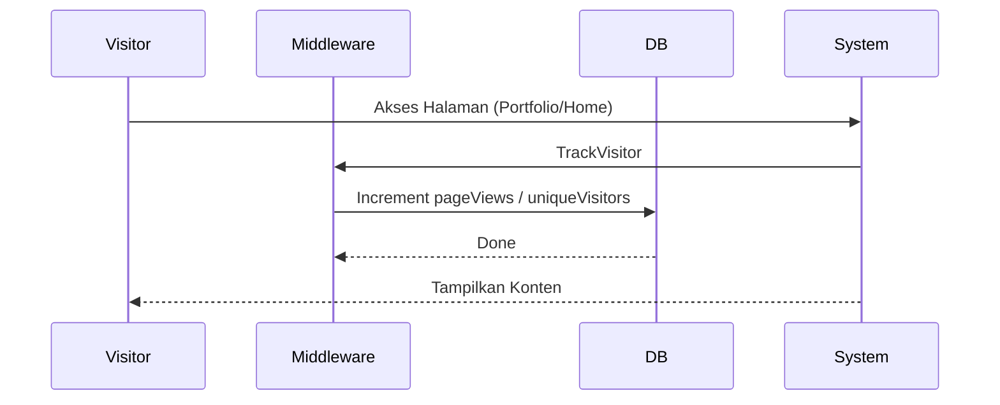

# Summary Proyek: Vidiooo

## 📌 Deskripsi Umum
**Vidiooo** adalah platform website modern untuk Creative Production House yang dikembangkan dengan Laravel. Website ini dirancang untuk menampilkan profil perusahaan, portfolio karya kreatif, paket layanan yang ditawarkan, sistem booking jadwal, manajemen pembayaran, serta sistem manajemen konten melalui Admin Panel yang intuitif dengan integrasi WhatsApp dan analytics.

---

## 🚀 Arsitektur & Tech Stack

### Backend & Frontend (Full Stack)
- **Framework**: Laravel 10/11 (PHP)
- **Template Engine**: Blade
- **Database**: MySQL/PostgreSQL
- **Authentication**: Laravel Sanctum/Breeze
- **Storage**: Laravel Storage untuk file management
- **Queue**: Laravel Queue untuk background jobs
- **Styling**: Tailwind CSS
- **JavaScript**: Alpine.js / Vue.js (untuk interaktivitas)
- **API Integration**: WhatsApp Business API

### Aesthetic
- Premium Dark UI
- Animasi Modern
- Glassmorphism elements

---

## 🎯 Detail Fitur Berdasarkan Diagram

### 👤 Aktor & Roles

#### Admin
Memiliki akses penuh untuk mengelola seluruh konten website:
- `login()` - Login ke admin panel
- `logout()` - Logout dari sistem
- `mengelolaPortofolio()` - CRUD portfolio
- `uploadFotoVideo()` - Upload media portfolio
- `editHapusKonten()` - Edit/hapus konten
- `lihatAnalytics()` - Melihat statistik website
- `shareKeSocialMedia()` - Share konten ke social media
- `updateCompanyInfo()` - Update info perusahaan
- `mengelolaPaketLayanan()` - CRUD paket layanan
- `mengelolaTestimoni()` - CRUD testimoni

#### User (Pengguna/Guest)
Pengunjung website yang dapat:
- `membacaAboutUs()` - Membaca halaman About Us
- `chatWhatsapp()` - Chat via WhatsApp
- `melihatPortofolio()` - Melihat daftar portfolio
- `melihatDetailFoto()` - Melihat detail portfolio
- `filterPortofolio()` - Filter portfolio berdasarkan kategori
- `booking.Jadwal()` - Booking jadwal acara
- `melihatPaketLayanan()` - Melihat paket layanan
- `melihatHarga()` - Melihat harga paket
- `melihatTestimoni()` - Membaca testimoni klien

---

## 📊 Struktur Database (Berdasarkan Class Diagram)

### 1. **User**
Tabel untuk pengguna/guest yang melakukan interaksi
```
Attributes:
- id_guest: String (Primary Key)

Methods:
+ membacaAboutUs(): void
+ chatWhatsapp(): void
+ melihatPortofolio(): void
+ melihatDetailFoto(): void
+ filterPortofolio(): void
+ booking.Jadwal(): void
+ melihatPaketLayanan(): void
+ melihatHarga(): void
+ melihatTestimoni(): void
```

### 2. **Admin**
Tabel untuk administrator sistem
```
Attributes:
- id_admin: String (Primary Key)
- username: String
- password: String (hashed)
- email: String

Methods:
+ login(): void
+ logout(): void
+ mengelolaPortofolio(): void
+ uploadFotoVideo(): void
+ editHapusKonten(): void
+ lihatAnalytics(): void
+ shareKeSocialMedia(): void
+ updateCompanyInfo(): void
+ mengelolaPaketLayanan(): void
+ mengelolaTestimoni(): void
```

### 3. **Portfolio**
Tabel untuk menyimpan karya/proyek
```
Attributes:
- idPortofolio: String (Primary Key)
- judul: String
- deskripsi: String
- kategori: String (Wedding, Event, Corporate, dll)
- gambarCover: String (path file)
- jumlahTayangan: int
- aktif: boolean

Methods:
+ tambahMedia(): void
+ publikasikan(): void
```

### 4. **Package** (Paket Layanan)
Tabel untuk paket layanan yang ditawarkan
```
Attributes:
- idPaket: String (Primary Key)
- namaPaket: String
- deskripsi: String
- hargaDasar: decimal
- inklusi: List<String> (fitur yang termasuk dalam paket)
- aktif: boolean

Methods:
+ hitungHarga(): decimal
```

### 5. **Company Info**
Tabel untuk informasi perusahaan
```
Attributes:
- namaPerusahaan: String
- email: String
- nomorWhatsApp: String
- alamat: String

Methods:
+ perbaruiInfo(): void
```

### 6. **Booking**
Tabel untuk booking jadwal
```
Attributes:
- idBooking: String (Primary Key)
- tanggalAcara: Date
- waktuAcara: Time
- lokasiAcara: String
- status: String (pending, confirmed, cancelled)
- totalHarga: decimal

Methods:
+ cekKetersediaan(): void
+ konfirmasi(): void
+ batalkan(): void
```

### 7. **Schedule** (Jadwal)
Tabel untuk manajemen jadwal ketersediaan
```
Attributes:
- idJadwal: String (Primary Key)
- tanggal: Date
- tersedia: boolean
- alasanDiblokir: String

Methods:
+ cekKonflik(): void
+ blokirTanggal(): void
```

### 8. **WhatsAppIntegration**
Service untuk integrasi WhatsApp Business API
```
Attributes:
- nomorPenerima: String
- pesan: String

Methods:
+ kirimPesan(): boolean
+ kirimKonfirmasiBooking(): void
```

### 9. **Notification**
Tabel untuk sistem notifikasi
```
Attributes:
- idNotifikasi: String (Primary Key)
- judul: String
- pesan: String
- sudahDibaca: boolean

Methods:
+ kirim(): void
+ tandaiDibaca(): void
```

### 10. **Payment**
Tabel untuk pembayaran
```
Attributes:
- idPembayaran: String (Primary Key)
- jumlah: decimal
- metodePembayaran: String
- statusPembayaran: String (pending, success, failed)
- tanggalBayar: DateTime

Methods:
+ prosesPembayaran(): void
+ verifikasiTransaksi(): void
```

### 11. **Testimonial**
Tabel untuk testimoni klien
```
Attributes:
- idTestimoni: String (Primary Key)
- rating: int (1-5)
- komentar: String
- disetujui: boolean

Methods:
+ setujui(): void
+ tolak(): void
```

### 12. **Analytics**
Tabel untuk tracking analytics website
```
Attributes:
- analyticsId: String (Primary Key)
- date: Date
- pageViews: int
- uniqueVisitors: int
- popularPortfolio: String
- conversionRate: decimal

Methods:
+ trackView(): void
+ generateReport(): void
+ getTopContent(): void
```

---

## 🔄 Relasi Antar Entitas

```
User 1 ──── * Booking (User dapat membuat banyak booking)
Booking * ──── 1 Package (Booking terkait dengan 1 paket)
Booking 1 ──── 1 Schedule (Booking menggunakan 1 jadwal)
Booking 1 ──── 1 Payment (Booking memiliki 1 pembayaran)
Booking 1 ──── * Notification (Booking menghasilkan notifikasi)
Booking 1 ──── 1 WhatsAppIntegration (Booking trigger WhatsApp)

Admin 1 ──── * Portfolio (Admin mengelola portfolio)
Admin 1 ──── * Package (Admin mengelola paket)
Admin 1 ──── * Testimonial (Admin mengelola testimoni)
Admin 1 ──── 1 CompanyInfo (Admin update company info)
Admin 1 ──── * Analytics (Admin melihat analytics)

Portfolio * ──── * User (User melihat portfolio)
Package * ──── * User (User melihat paket)
Testimonial * ──── * User (User melihat testimoni)
```

---

## 🌐 Fitur Website Lengkap

### Halaman Publik (User)

#### 1. **Home Page**
- Hero section dengan tagline perusahaan
- Featured portfolio (karya terbaru)
- Paket layanan unggulan
- Testimoni klien terpilih
- Call-to-action untuk booking

#### 2. **Portfolio Page**
- Gallery portfolio dengan thumbnail
- Filter berdasarkan kategori (Wedding, Event, Corporate, dll)
- Detail view dengan lightbox untuk foto/video
- Informasi: judul, deskripsi, kategori
- Counter jumlah tayangan
- Tombol share ke social media

#### 3. **Packages Page (Paket Layanan)**
- Daftar paket layanan
- Kartu paket dengan:
  - Nama paket
  - Deskripsi singkat
  - Harga dasar
  - Inklusi (list fitur yang termasuk)
- Tombol "Booking Sekarang"

#### 4. **About Us Page**
- Profil perusahaan Vidiooo
- Visi dan misi
- Nilai-nilai perusahaan
- Informasi kontak (email, WhatsApp, alamat)

#### 5. **Booking Page**
- Form booking dengan field:
  - Pilih paket layanan
  - Tanggal acara (dengan calendar picker)
  - Waktu acara
  - Lokasi acara
- Real-time cek ketersediaan jadwal
- Kalkulasi harga otomatis
- Konfirmasi via WhatsApp

#### 6. **Testimonials Page**
- Daftar testimoni yang sudah disetujui
- Rating bintang (1-5)
- Nama klien dan komentar
- Filter berdasarkan rating

#### 7. **Contact Page**
- Informasi kontak perusahaan
- Tombol WhatsApp untuk chat langsung
- Google Maps embed (lokasi alamat)
- Form kontak sederhana

---

### Admin Panel

#### 1. **Dashboard**
- **Analytics Overview:**
  - Total page views hari ini/bulan ini
  - Unique visitors
  - Popular portfolio (most viewed)
  - Conversion rate
- **Quick Stats:**
  - Total portfolio aktif
  - Total paket layanan
  - Pending bookings
  - Pending testimonials
- **Recent Activities:**
  - Booking terbaru
  - Payment terbaru
  - Testimoni baru

#### 2. **Portfolio Management**
**List Portfolio:**
- Tabel dengan kolom: Thumbnail, Judul, Kategori, Status, Jumlah Tayangan, Aksi
- Filter berdasarkan kategori
- Search bar

**Create/Edit Portfolio:**
- Form input:
  - Judul portfolio
  - Deskripsi lengkap
  - Kategori (dropdown)
  - Upload gambar cover
  - Upload multiple foto/video (tambahMedia)
  - Toggle aktif/nonaktif (publikasikan)
- Preview hasil
- Tombol simpan

**Analytics per Portfolio:**
- Jumlah tayangan
- Engagement rate
- Traffic source

#### 3. **Package Management**
**List Packages:**
- Tabel: Nama Paket, Harga Dasar, Status, Aksi
- Quick toggle aktif/nonaktif

**Create/Edit Package:**
- Form input:
  - Nama paket
  - Deskripsi
  - Harga dasar (hitungHarga untuk kalkulasi final)
  - Inklusi (list fitur yang termasuk) - dynamic field
  - Toggle aktif/nonaktif
- Preview paket

#### 4. **Booking Management**
**List Bookings:**
- Tabel: ID Booking, Nama User, Tanggal Acara, Paket, Status, Total Harga, Aksi
- Filter berdasarkan status (pending, confirmed, cancelled)
- Filter berdasarkan tanggal

**Detail Booking:**
- Informasi lengkap booking
- Timeline status booking
- Tombol aksi:
  - Konfirmasi booking (konfirmasi)
  - Batalkan booking (batalkan)
  - Kirim pesan WhatsApp ke customer
- Cek konflik jadwal (cekKonflik)

**Schedule Calendar:**
- Calendar view ketersediaan
- Indikator tanggal:
  - Tersedia (hijau)
  - Sudah dibooking (merah)
  - Diblokir manual (kuning)
- Fitur blokirTanggal untuk blokir tanggal tertentu
- Input alasan diblokir

#### 5. **Payment Management**
**List Payments:**
- Tabel: ID Pembayaran, ID Booking, Jumlah, Metode, Status, Tanggal Bayar, Aksi
- Filter berdasarkan status (pending, success, failed)

**Verify Payment:**
- Upload bukti pembayaran (dari customer)
- Detail transaksi
- Tombol verifikasiTransaksi
- Otomatis kirim konfirmasi via WhatsApp setelah verifikasi

**Payment Report:**
- Total pendapatan per periode
- Breakdown per metode pembayaran
- Pending payments

#### 6. **Testimonial Management**
**List Testimonials:**
- Tabel: Rating, Nama Klien, Komentar (preview), Status, Aksi
- Filter: Pending, Approved, Rejected

**Moderate Testimonial:**
- View full komentar
- Rating yang diberikan
- Tombol aksi:
  - Setujui (setujui) - tampil di website
  - Tolak (tolak) - tidak tampil

#### 7. **Analytics Dashboard**
**Traffic Analytics:**
- Line chart page views per hari
- Unique visitors count
- Bounce rate
- Average session duration

**Content Performance:**
- Top 10 portfolio paling banyak dilihat (getTopContent)
- Category dengan traffic tertinggi
- Trending content

**Conversion Tracking:**
- Conversion rate (visitor → booking)
- Funnel analysis
- Goal completion

**Report Generation:**
- Pilih periode (hari ini, minggu ini, bulan ini, custom range)
- Generate report (generateReport)
- Export ke PDF/Excel

#### 8. **Company Settings**
**Company Information:**
- Edit form:
  - Nama perusahaan
  - Email
  - Nomor WhatsApp
  - Alamat lengkap
- Tombol perbaruiInfo untuk save changes

**WhatsApp Configuration:**
- WhatsApp API token
- Business number
- Message templates untuk berbagai notifikasi

**Social Media:**
- Link Instagram
- Link Facebook
- Link YouTube
- Link TikTok
- Tombol shareKeSocialMedia untuk auto-share content

**System Settings:**
- Timezone
- Currency
- Default language

---

## 🔔 Sistem Notifikasi & WhatsApp

### Notifikasi untuk Admin:
1. **Booking Baru** - kirim via WhatsApp
   - Pesan: "Booking baru dari [Nama] untuk tanggal [Tanggal Acara]"
   - Action: Lihat detail di admin panel

2. **Pembayaran Diterima**
   - Pesan: "Pembayaran diterima untuk booking #[ID]"
   - Action: Verifikasi pembayaran

3. **Testimoni Baru**
   - Pesan: "Testimoni baru menunggu approval"
   - Action: Review testimoni

### Notifikasi untuk User/Customer:
1. **Konfirmasi Booking** (kirimKonfirmasiBooking)
   - Pesan: "Booking Anda telah diterima. ID Booking: [ID]"
   - Detail: Tanggal, waktu, lokasi, total harga

2. **Pembayaran Terverifikasi**
   - Pesan: "Pembayaran Anda telah diverifikasi. Terima kasih!"

3. **Reminder H-3 Acara**
   - Pesan: "Reminder: Acara Anda 3 hari lagi pada [Tanggal]"

4. **Booking Dibatalkan**
   - Pesan: "Maaf, booking Anda dibatalkan. [Alasan]"

---

## 📡 API Endpoints (Laravel Routes)

### Public Routes
```php
// Home & Info
GET  /                          -> HomeController@index
GET  /about                     -> HomeController@about
GET  /contact                   -> HomeController@contact

// Portfolio
GET  /portfolio                 -> PortfolioController@index
GET  /portfolio/category/{cat}  -> PortfolioController@filterByCategory
GET  /portfolio/{id}            -> PortfolioController@show
POST /portfolio/{id}/track      -> PortfolioController@trackView

// Packages
GET  /packages                  -> PackageController@index
GET  /packages/{id}             -> PackageController@show

// Booking
GET  /booking                   -> BookingController@create
POST /booking                   -> BookingController@store
POST /booking/check-available   -> BookingController@checkAvailability

// Testimonials
GET  /testimonials              -> TestimonialController@index

// WhatsApp
GET  /whatsapp/chat             -> WhatsAppController@redirectToChat
```

### Admin Routes (Protected with auth:admin middleware)
```php
// Auth
GET  /admin/login               -> Admin\AuthController@showLogin
POST /admin/login               -> Admin\AuthController@login
POST /admin/logout              -> Admin\AuthController@logout

// Dashboard
GET  /admin/dashboard           -> Admin\DashboardController@index

// Portfolio Management
GET  /admin/portfolio           -> Admin\PortfolioController@index
GET  /admin/portfolio/create    -> Admin\PortfolioController@create
POST /admin/portfolio           -> Admin\PortfolioController@store
GET  /admin/portfolio/{id}/edit -> Admin\PortfolioController@edit
PUT  /admin/portfolio/{id}      -> Admin\PortfolioController@update
DELETE /admin/portfolio/{id}    -> Admin\PortfolioController@destroy
POST /admin/portfolio/media     -> Admin\PortfolioController@uploadMedia
PUT  /admin/portfolio/{id}/publish -> Admin\PortfolioController@publish

// Package Management
GET  /admin/packages            -> Admin\PackageController@index
GET  /admin/packages/create     -> Admin\PackageController@create
POST /admin/packages            -> Admin\PackageController@store
GET  /admin/packages/{id}/edit  -> Admin\PackageController@edit
PUT  /admin/packages/{id}       -> Admin\PackageController@update
DELETE /admin/packages/{id}     -> Admin\PackageController@destroy
POST /admin/packages/{id}/calculate -> Admin\PackageController@calculatePrice

// Booking Management
GET  /admin/bookings            -> Admin\BookingController@index
GET  /admin/bookings/{id}       -> Admin\BookingController@show
PUT  /admin/bookings/{id}/confirm -> Admin\BookingController@confirm
PUT  /admin/bookings/{id}/cancel  -> Admin\BookingController@cancel
GET  /admin/bookings/calendar   -> Admin\BookingController@calendar

// Schedule Management
GET  /admin/schedule            -> Admin\ScheduleController@index
POST /admin/schedule/block      -> Admin\ScheduleController@blockDate
POST /admin/schedule/check-conflict -> Admin\ScheduleController@checkConflict

// Payment Management
GET  /admin/payments            -> Admin\PaymentController@index
GET  /admin/payments/{id}       -> Admin\PaymentController@show
POST /admin/payments/{id}/verify -> Admin\PaymentController@verify
POST /admin/payments/{id}/process -> Admin\PaymentController@process

// Testimonial Management
GET  /admin/testimonials        -> Admin\TestimonialController@index
PUT  /admin/testimonials/{id}/approve -> Admin\TestimonialController@approve
PUT  /admin/testimonials/{id}/reject -> Admin\TestimonialController@reject
DELETE /admin/testimonials/{id} -> Admin\TestimonialController@destroy

// Analytics
GET  /admin/analytics           -> Admin\AnalyticsController@index
POST /admin/analytics/track     -> Admin\AnalyticsController@trackView
POST /admin/analytics/report    -> Admin\AnalyticsController@generateReport
GET  /admin/analytics/top-content -> Admin\AnalyticsController@getTopContent

// Settings
GET  /admin/settings            -> Admin\SettingsController@index
PUT  /admin/settings/company    -> Admin\SettingsController@updateCompany
PUT  /admin/settings/whatsapp   -> Admin\SettingsController@updateWhatsApp
PUT  /admin/settings/social     -> Admin\SettingsController@updateSocial

// Notifications
GET  /admin/notifications       -> Admin\NotificationController@index
PUT  /admin/notifications/{id}/read -> Admin\NotificationController@markAsRead
POST /admin/notifications/send  -> Admin\NotificationController@send
```

---

## 📁 Struktur Folder Laravel

```
vidiooo-laravel/
├── app/
│   ├── Http/
│   │   ├── Controllers/
│   │   │   ├── HomeController.php
│   │   │   ├── PortfolioController.php
│   │   │   ├── PackageController.php
│   │   │   ├── BookingController.php
│   │   │   ├── TestimonialController.php
│   │   │   ├── WhatsAppController.php
│   │   │   └── Admin/
│   │   │       ├── AuthController.php
│   │   │       ├── DashboardController.php
│   │   │       ├── PortfolioController.php
│   │   │       ├── PackageController.php
│   │   │       ├── BookingController.php
│   │   │       ├── ScheduleController.php
│   │   │       ├── PaymentController.php
│   │   │       ├── TestimonialController.php
│   │   │       ├── AnalyticsController.php
│   │   │       ├── SettingsController.php
│   │   │       └── NotificationController.php
│   │   ├── Middleware/
│   │   │   ├── AdminAuth.php
│   │   │   └── TrackVisitor.php
│   │   └── Requests/
│   │       ├── BookingRequest.php
│   │       ├── PortfolioRequest.php
│   │       └── PackageRequest.php
│   ├── Models/
│   │   ├── User.php
│   │   ├── Admin.php
│   │   ├── Portfolio.php
│   │   ├── Package.php
│   │   ├── CompanyInfo.php
│   │   ├── Booking.php
│   │   ├── Schedule.php
│   │   ├── WhatsAppIntegration.php
│   │   ├── Notification.php
│   │   ├── Payment.php
│   │   ├── Testimonial.php
│   │   └── Analytics.php
│   ├── Services/
│   │   ├── WhatsAppService.php
│   │   ├── AnalyticsService.php
│   │   ├── BookingService.php
│   │   ├── PaymentService.php
│   │   └── NotificationService.php
│   └── Jobs/
│       ├── SendWhatsAppNotification.php
│       ├── GenerateAnalyticsReport.php
│       ├── ProcessPayment.php
│       └── SendBookingReminder.php
├── database/
│   ├── migrations/
│   │   ├── create_admins_table.php
│   │   ├── create_users_table.php
│   │   ├── create_portfolios_table.php
│   │   ├── create_packages_table.php
│   │   ├── create_company_infos_table.php
│   │   ├── create_bookings_table.php
│   │   ├── create_schedules_table.php
│   │   ├── create_payments_table.php
│   │   ├── create_notifications_table.php
│   │   ├── create_testimonials_table.php
│   │   └── create_analytics_table.php
│   └── seeders/
│       ├── AdminSeeder.php
│       ├── PackageSeeder.php
│       ├── PortfolioSeeder.php
│       └── CompanyInfoSeeder.php
├── resources/
│   ├── views/
│   │   ├── layouts/
│   │   │   ├── app.blade.php
│   │   │   ├── admin.blade.php
│   │   │   ├── navigation.blade.php
│   │   │   └── footer.blade.php
│   │   ├── home.blade.php
│   │   ├── about.blade.php
│   │   ├── contact.blade.php
│   │   ├── portfolio/
│   │   │   ├── index.blade.php
│   │   │   └── show.blade.php
│   │   ├── packages/
│   │   │   ├── index.blade.php
│   │   │   └── show.blade.php
│   │   ├── booking/
│   │   │   ├── create.blade.php
│   │   │   └── success.blade.php
│   │   ├── testimonials/
│   │   │   └── index.blade.php
│   │   └── admin/
│   │       ├── auth/
│   │       │   └── login.blade.php
│   │       ├── dashboard.blade.php
│   │       ├── portfolio/
│   │       │   ├── index.blade.php
│   │       │   ├── create.blade.php
│   │       │   └── edit.blade.php
│   │       ├── packages/
│   │       │   ├── index.blade.php
│   │       │   ├── create.blade.php
│   │       │   └── edit.blade.php
│   │       ├── bookings/
│   │       │   ├── index.blade.php
│   │       │   ├── show.blade.php
│   │       │   └── calendar.blade.php
│   │       ├── payments/
│   │       │   ├── index.blade.php
│   │       │   └── show.blade.php
│   │       ├── testimonials/
│   │       │   └── index.blade.php
│   │       ├── analytics/
│   │       │   └── index.blade.php
│   │       └── settings/
│   │           └── index.blade.php
│   ├── css/
│   │   └── app.css
│   └── js/
│       ├── app.js
│       └── admin.js
├── routes/
│   ├── web.php
│   └── admin.php
├── public/
│   ├── css/
│   ├── js/
│   ├── images/
│   └── storage/
│       ├── portfolio/
│       ├── packages/
│       └── payments/
├── config/
│   ├── whatsapp.php
│   └── analytics.php
├── .env
├── composer.json
└── package.json
```

---

## 🎨 Detail Views & UI Structure

### 🌐 Public Views (User Interface)

#### 1. **Layout Master (`layouts/app.blade.php`)**
Layout utama untuk halaman publik dengan struktur:
```blade
<!DOCTYPE html>
<html>
<head>
    <title>@yield('title') - Vidiooo</title>
    <link href="{{ asset('css/app.css') }}" rel="stylesheet">
    @stack('styles')
</head>
<body class="bg-dark text-white">
    <!-- Navigation -->
    @include('layouts.navigation')
    
    <!-- Main Content -->
    <main>
        @yield('content')
    </main>
    
    <!-- Footer -->
    @include('layouts.footer')
    
    <script src="{{ asset('js/app.js') }}"></script>
    @stack('scripts')
</body>
</html>
```

**Komponen:**
- **Navigation Bar**: Logo, Menu (Home, Portfolio, Packages, About, Contact), CTA Button "Booking Now"
- **Footer**: Company info, social media links, copyright

---

#### 2. **Home Page (`home.blade.php`)**
URL: `/`

**Sections:**
```blade
@extends('layouts.app')

@section('content')
<!-- Hero Section -->
<section class="hero-section h-screen flex items-center">
    <div class="container mx-auto">
        <h1 class="text-6xl font-bold">Creative Excellence Awaits</h1>
        <p class="text-xl mt-4">Transform Your Brand Vision Into Stunning Visual Stories</p>
        <a href="{{ route('packages.index') }}" class="btn-primary mt-6">
            Explore Our Packages
        </a>
    </div>
</section>

<!-- Featured Portfolio -->
<section class="featured-portfolio py-20">
    <h2 class="text-4xl text-center mb-12">Our Latest Work</h2>
    <div class="grid grid-cols-3 gap-8">
        @foreach($featuredPortfolios as $portfolio)
            <div class="portfolio-card" data-id="{{ $portfolio->idPortofolio }}">
                gambarCover }}" alt="{{ $portfolio->judul }}">
                <h3>{{ $portfolio->judul }}</h3>
                <span class="category">{{ $portfolio->kategori }}</span>
            </div>
        @endforeach
    </div>
</section>

<!-- Packages Preview -->
<section class="packages-preview py-20 bg-gray-900">
    <h2 class="text-4xl text-center mb-12">Our Services</h2>
    <div class="grid grid-cols-3 gap-8">
        @foreach($packages as $package)
            <div class="package-card glass-morphism">
                <h3>{{ $package->namaPaket }}</h3>
                <p class="price">Rp {{ number_format($package->hargaDasar, 0, ',', '.') }}</p>
                <ul class="features">
                    @foreach($package->inklusi as $feature)
                        <li>✓ {{ $feature }}</li>
                    @endforeach
                </ul>
                <a href="{{ route('booking.create', $package->idPaket) }}">Book Now</a>
            </div>
        @endforeach
    </div>
</section>

<!-- Testimonials Slider -->
<section class="testimonials py-20">
    <h2 class="text-4xl text-center mb-12">What Our Clients Say</h2>
    <div class="testimonial-slider">
        @foreach($testimonials as $testimonial)
            <div class="testimonial-item">
                <div class="stars">
                    @for($i = 0; $i < $testimonial->rating; $i++)
                        ★
                    @endfor
                </div>
                <p class="comment">{{ $testimonial->komentar }}</p>
            </div>
        @endforeach
    </div>
</section>

<!-- Stats Counter -->
<section class="stats py-20 bg-gradient">
    <div class="grid grid-cols-4 gap-8 text-center">
        <div>
            <h3 class="text-5xl font-bold">{{ $stats['totalProjects'] }}+</h3>
            <p>Projects Completed</p>
        </div>
        <div>
            <h3 class="text-5xl font-bold">{{ $stats['happyClients'] }}+</h3>
            <p>Happy Clients</p>
        </div>
        <div>
            <h3 class="text-5xl font-bold">{{ $stats['yearsExperience'] }}+</h3>
            <p>Years Experience</p>
        </div>
        <div>
            <h3 class="text-5xl font-bold">{{ $stats['awards'] }}+</h3>
            <p>Awards Won</p>
        </div>
    </div>
</section>
@endsection
```

---

#### 3. **Portfolio Page (`portfolio/index.blade.php`)**
URL: `/portfolio`

**Layout:**
```blade
@extends('layouts.app')

@section('content')
<!-- Page Header -->
<section class="page-header py-20 text-center">
    <h1 class="text-5xl font-bold">Our Portfolio</h1>
    <p class="text-xl mt-4">Capturing Moments, Creating Memories</p>
</section>

<!-- Filter Categories -->
<section class="filters py-10">
    <div class="container mx-auto">
        <div class="flex justify-center gap-4">
            <button class="filter-btn active" data-category="all">All</button>
            <button class="filter-btn" data-category="wedding">Wedding</button>
            <button class="filter-btn" data-category="event">Event</button>
            <button class="filter-btn" data-category="corporate">Corporate</button>
            <button class="filter-btn" data-category="product">Product</button>
        </div>
    </div>
</section>

<!-- Portfolio Grid -->
<section class="portfolio-grid py-10">
    <div class="container mx-auto">
        <div class="grid grid-cols-3 gap-6" id="portfolioContainer">
            @foreach($portfolios as $portfolio)
                <div class="portfolio-item" data-category="{{ $portfolio->kategori }}">
                    <div class="relative overflow-hidden rounded-lg group">
                        gambarCover }}" 
                             alt="{{ $portfolio->judul }}"
                             class="w-full h-80 object-cover transition-transform group-hover:scale-110">
                        <div class="absolute inset-0 bg-black bg-opacity-0 group-hover:bg-opacity-70 transition-all flex items-center justify-center">
                            <div class="text-center opacity-0 group-hover:opacity-100">
                                <h3 class="text-2xl font-bold mb-2">{{ $portfolio->judul }}</h3>
                                <p class="mb-4">{{ $portfolio->deskripsi }}</p>
                                <a href="{{ route('portfolio.show', $portfolio->idPortofolio) }}" 
                                   class="btn-primary">View Details</a>
                            </div>
                        </div>
                        <div class="absolute top-4 right-4">
                            <span class="bg-white text-black px-3 py-1 rounded-full text-sm">
                                {{ $portfolio->kategori }}
                            </span>
                        </div>
                    </div>
                    <div class="mt-4">
                        <h3 class="text-xl font-semibold">{{ $portfolio->judul }}</h3>
                        <p class="text-gray-400 text-sm">👁️ {{ $portfolio->jumlahTayangan }} views</p>
                    </div>
                </div>
            @endforeach
        </div>
    </div>
</section>
@endsection

@push('scripts')
<script>
// Filter functionality
document.querySelectorAll('.filter-btn').forEach(btn => {
    btn.addEventListener('click', function() {
        const category = this.dataset.category;
        
        // Update active button
        document.querySelectorAll('.filter-btn').forEach(b => b.classList.remove('active'));
        this.classList.add('active');
        
        // Filter portfolio items
        document.querySelectorAll('.portfolio-item').forEach(item => {
            if (category === 'all' || item.dataset.category === category) {
                item.style.display = 'block';
            } else {
                item.style.display = 'none';
            }
        });
    });
});

// Track view when clicking portfolio item
document.querySelectorAll('.portfolio-item').forEach(item => {
    item.addEventListener('click', function() {
        const portfolioId = this.dataset.id;
        fetch(`/api/portfolio/${portfolioId}/track`, { method: 'POST' });
    });
});
</script>
@endpush
```

---

#### 4. **Portfolio Detail (`portfolio/show.blade.php`)**
URL: `/portfolio/{id}`

**Layout:**
```blade
@extends('layouts.app')

@section('content')
<!-- Portfolio Header -->
<section class="portfolio-header py-20">
    <div class="container mx-auto">
        <div class="flex items-center gap-4 mb-6">
            <a href="{{ route('portfolio.index') }}" class="text-gray-400 hover:text-white">
                ← Back to Portfolio
            </a>
        </div>
        <h1 class="text-5xl font-bold mb-4">{{ $portfolio->judul }}</h1>
        <div class="flex items-center gap-6">
            <span class="bg-purple-600 px-4 py-2 rounded-full">{{ $portfolio->kategori }}</span>
            <span class="text-gray-400">👁️ {{ $portfolio->jumlahTayangan }} views</span>
        </div>
    </div>
</section>

<!-- Main Image -->
<section class="main-image">
    <div class="container mx-auto">
        gambarCover }}" 
             alt="{{ $portfolio->judul }}"
             class="w-full rounded-lg shadow-2xl">
    </div>
</section>

<!-- Description -->
<section class="description py-20">
    <div class="container mx-auto max-w-4xl">
        <h2 class="text-3xl font-bold mb-6">About This Project</h2>
        <p class="text-lg leading-relaxed">{{ $portfolio->deskripsi }}</p>
    </div>
</section>

<!-- Image Gallery (if multiple images) -->
@if(count($portfolio->media) > 0)
<section class="gallery py-20 bg-gray-900">
    <div class="container mx-auto">
        <h2 class="text-3xl font-bold mb-12 text-center">Project Gallery</h2>
        <div class="grid grid-cols-3 gap-6">
            @foreach($portfolio->media as $media)
                <div class="gallery-item">
                    
                </div>
            @endforeach
        </div>
    </div>
</section>
@endif

<!-- Share Buttons -->
<section class="share py-10">
    <div class="container mx-auto text-center">
        <h3 class="text-xl mb-4">Share This Project</h3>
        <div class="flex justify-center gap-4">
            <a href="#" class="share-btn facebook">Facebook</a>
            <a href="#" class="share-btn twitter">Twitter</a>
            <a href="#" class="share-btn whatsapp">WhatsApp</a>
            <a href="#" class="share-btn linkedin">LinkedIn</a>
        </div>
    </div>
</section>

<!-- Lightbox Modal -->
<div id="lightbox" class="fixed inset-0 bg-black bg-opacity-90 hidden items-center justify-center z-50" onclick="closeLightbox()">
    
</div>
@endsection

@push('scripts')
<script>
function openLightbox(src) {
    document.getElementById('lightbox').classList.remove('hidden');
    document.getElementById('lightbox').classList.add('flex');
    document.getElementById('lightbox-img').src = src;
}

function closeLightbox() {
    document.getElementById('lightbox').classList.add('hidden');
    document.getElementById('lightbox').classList.remove('flex');
}
</script>
@endpush
```

---

#### 5. **Packages Page (`packages/index.blade.php`)**
URL: `/packages`

```blade
@extends('layouts.app')

@section('content')
<!-- Header -->
<section class="page-header py-20 text-center bg-gradient">
    <h1 class="text-5xl font-bold mb-4">Our Packages</h1>
    <p class="text-xl">Choose the perfect package for your needs</p>
</section>

<!-- Packages Grid -->
<section class="packages py-20">
    <div class="container mx-auto">
        <div class="grid grid-cols-3 gap-10">
            @foreach($packages as $package)
                <div class="package-card bg-gray-900 rounded-lg p-8 hover:transform hover:scale-105 transition-all">
                    <!-- Package Header -->
                    <div class="text-center mb-6">
                        <h3 class="text-2xl font-bold mb-2">{{ $package->namaPaket }}</h3>
                        <p class="text-gray-400">{{ $package->deskripsi }}</p>
                    </div>
                    
                    <!-- Price -->
                    <div class="text-center mb-8">
                        <p class="text-5xl font-bold text-purple-500">
                            Rp {{ number_format($package->hargaDasar, 0, ',', '.') }}
                        </p>
                        <p class="text-gray-400 text-sm mt-2">Starting Price</p>
                    </div>
                    
                    <!-- Features -->
                    <div class="mb-8">
                        <h4 class="font-semibold mb-4">What's Included:</h4>
                        <ul class="space-y-3">
                            @foreach(json_decode($package->inklusi) as $feature)
                                <li class="flex items-start">
                                    <svg class="w-6 h-6 text-green-500 mr-2" fill="currentColor" viewBox="0 0 20 20">
                                        <path d="M16.707 5.293a1 1 0 010 1.414l-8 8a1 1 0 01-1.414 0l-4-4a1 1 0 011.414-1.414L8 12.586l7.293-7.293a1 1 0 011.414 0z"/>
                                    </svg>
                                    <span>{{ $feature }}</span>
                                </li>
                            @endforeach
                        </ul>
                    </div>
                    
                    <!-- CTA Button -->
                    <a href="{{ route('booking.create', ['package' => $package->idPaket]) }}" 
                       class="block w-full bg-purple-600 hover:bg-purple-700 text-center py-3 rounded-lg font-semibold transition">
                        Book This Package
                    </a>
                </div>
            @endforeach
        </div>
    </div>
</section>

<!-- Custom Package CTA -->
<section class="custom-package py-20 bg-gray-900 text-center">
    <div class="container mx-auto">
        <h2 class="text-4xl font-bold mb-4">Need a Custom Package?</h2>
        <p class="text-xl mb-8">Let's discuss your specific requirements</p>
        <a href="{{ route('contact') }}" class="btn-primary">Contact Us</a>
    </div>
</section>
@endsection
```

---

#### 6. **Booking Page (`booking/create.blade.php`)**
URL: `/booking`

```blade
@extends('layouts.app')

@section('content')
<section class="booking-page py-20">
    <div class="container mx-auto max-w-4xl">
        <h1 class="text-4xl font-bold mb-8 text-center">Book Your Event</h1>
        
        <form action="{{ route('booking.store') }}" method="POST" id="bookingForm" class="bg-gray-900 p-8 rounded-lg">
            @csrf
            
            <!-- Package Selection -->
            <div class="mb-6">
                <label class="block mb-2 font-semibold">Select Package</label>
                <select name="package_id" id="packageSelect" class="w-full p-3 rounded bg-gray-800" required>
                    <option value="">Choose a package...</option>
                    @foreach($packages as $package)
                        <option value="{{ $package->idPaket }}" 
                                data-price="{{ $package->hargaDasar }}"
                                {{ request('package') == $package->idPaket ? 'selected' : '' }}>
                            {{ $package->namaPaket }} - Rp {{ number_format($package->hargaDasar, 0, ',', '.') }}
                        </option>
                    @endforeach
                </select>
            </div>
            
            <!-- Event Date -->
            <div class="mb-6">
                <label class="block mb-2 font-semibold">Event Date</label>
                <input type="date" 
                       name="tanggal_acara" 
                       id="eventDate"
                       class="w-full p-3 rounded bg-gray-800" 
                       min="{{ date('Y-m-d') }}"
                       required>
                <p class="text-sm text-gray-400 mt-2">Available dates will be highlighted</p>
            </div>
            

---

## 📈 Diagram Aktivitas (Activity Diagram)

Diagram aktivitas menggambarkan alur kerja sistem dari perspektif Admin dan Pengguna.



### Penjelasan Alur Utama:
1. **Sistem Booking**: Pengguna memilih paket, sistem melakukan pengecekan ketersediaan jadwal secara real-time. Jika tersedia, pengguna diarahkan untuk konfirmasi via WhatsApp.
2. **Manajemen Portofolio**: Admin dapat mengunggah media baru, mengedit, atau menghapus karya yang sudah dipublikasikan. Setiap interaksi tercatat dalam log tayangan.
3. **Moderasi**: Testimoni dari pelanggan tidak langsung tampil, melainkan harus melewati tahap persetujuan (approval) oleh Admin.

---

## 🔗 Diagram Sekuens (Sequence Diagram)

Diagram sekuens menunjukkan interaksi antar objek sistem dalam urutan waktu.

### 1. Proses Booking & Notifikasi


### 2. Autentikasi Admin


### 3. Verifikasi Pembayaran


### 4. Moderasi Testimoni


### 5. Tracking Analytics


---

## 🚀 Setup & Installation

### 1. Persiapan Environment
```bash
# Clone repository
git clone <repository-url>
cd vidiooo-laravel

# Install PHP dependencies
composer install

# Install Node dependencies
npm install
```

### 2. Konfigurasi Environment
```bash
# Copy environment file
cp .env.example .env

# Generate application key
php artisan key:generate
```

### 3. Setup Database
Edit file `.env`:
```env
DB_CONNECTION=mysql
DB_HOST=127.0.0.1
DB_PORT=3306
DB_DATABASE=vidiooo_db
DB_USERNAME=root
DB_PASSWORD=
```

Jalankan migration dan seeder:
```bash
# Run migrations
php artisan migrate

# Seed initial data
php artisan db:seed
```

### 4. Setup WhatsApp Integration
Edit file `.env`:
```env
WHATSAPP_API_URL=https://api.whatsapp.com/v1
WHATSAPP_API_TOKEN=your_api_token_here
WHATSAPP_BUSINESS_NUMBER=628123456789
```

### 5. Setup Storage
```bash
# Create storage link
php artisan storage:link

# Set permissions
chmod -R 775 storage bootstrap/cache
```

### 6. Build Assets
```bash
# Development
npm run dev

# Production
npm run build
```

### 7. Run Application
```bash
# Run development server
php artisan serve

# Run queue worker (untuk background jobs)
php artisan queue:work

# Run scheduler (untuk cron jobs seperti reminder)
php artisan schedule:work
```

Website akan berjalan di: `http://localhost:8000`

---

## 🔐 Default Admin Credentials
```
Username: admin
Password: admin123
Email: admin@vidiooo.com
```

**⚠️ PENTING:** Segera ubah password default setelah login pertama kali!

---

## 🎯 Kesimpulan

Proyek **Vidiooo** adalah platform Creative Production House yang comprehensive dengan fitur lengkap:

### ✅ Fitur Utama:
- **Portfolio Management** dengan kategori dan tracking views
- **Package System** dengan kalkulasi harga dinamis
- **Booking System** dengan real-time availability checking dan conflict detection
- **Payment Processing** dengan verifikasi manual dan multiple payment methods
- **WhatsApp Integration** untuk notifikasi otomatis ke admin dan customer
- **Analytics System** untuk tracking traffic, popular content, dan conversion rate
- **Testimonial Management** dengan sistem approval
- **Schedule Management** dengan calendar view dan block date
- **Notification System** untuk real-time updates
- **Company Settings** untuk manajemen info perusahaan

### 🛠️ Teknologi:
Platform ini dibangun dengan **Laravel** yang memberikan:
- MVC architecture yang solid dan maintainable
- Built-in authentication dan authorization
- Eloquent ORM untuk database management
- Queue system untuk background processing
- Scheduler untuk automated tasks (reminder, report generation)
- Blade templating yang powerful
- Security features (CSRF, XSS protection, encryption)

### 📊 Database Design:
12 tabel utama yang saling terintegrasi:
User, Admin, Portfolio, Package, CompanyInfo, Booking, Schedule, WhatsAppIntegration, Notification, Payment, Testimonial, Analytics

**Vidiooo - Transform your brand vision into stunning visual stories.** 📸🎥✨

# Summary Proyek Vidiooo - Lanjutan Part 2

## 📄 Lanjutan Views

### 🔐 Admin Panel Views (Lanjutan)

#### 1. **Admin Login (`admin/auth/login.blade.php`)**
URL: `/admin/login`

```blade
<!DOCTYPE html>
<html lang="en">
<head>
    <meta charset="UTF-8">
    <meta name="viewport" content="width=device-width, initial-scale=1.0">
    <title>Admin Login - Vidiooo</title>
    <link href="{{ asset('css/app.css') }}" rel="stylesheet">
</head>
<body class="bg-dark min-h-screen flex items-center justify-center">
    <div class="max-w-md w-full">
        <!-- Logo -->
        <div class="text-center mb-8">
            <h1 class="text-4xl font-bold text-white mb-2">Vidiooo</h1>
            <p class="text-gray-400">Admin Panel</p>
        </div>
        
        <!-- Login Card -->
        <div class="bg-gray-900 p-8 rounded-lg shadow-2xl">
            <h2 class="text-2xl font-bold text-white mb-6">Login to Dashboard</h2>
            
            @if($errors->any())
                <div class="bg-red-900 border border-red-500 text-white p-4 rounded mb-4">
                    <ul class="list-disc list-inside">
                        @foreach($errors->all() as $error)
                            <li>{{ $error }}</li>
                        @endforeach
                    </ul>
                </div>
            @endif
            
            @if(session('success'))
                <div class="bg-green-900 border border-green-500 text-white p-4 rounded mb-4">
                    {{ session('success') }}
                </div>
            @endif
            
            <form action="{{ route('admin.login') }}" method="POST">
                @csrf
                
                <!-- Username -->
                <div class="mb-4">
                    <label class="block text-gray-400 mb-2">Username</label>
                    <input type="text" 
                           name="username" 
                           class="w-full p-3 rounded bg-gray-800 text-white border border-gray-700 focus:border-purple-500 focus:outline-none"
                           value="{{ old('username') }}"
                           required>
                </div>
                
                <!-- Password -->
                <div class="mb-6">
                    <label class="block text-gray-400 mb-2">Password</label>
                    <input type="password" 
                           name="password" 
                           class="w-full p-3 rounded bg-gray-800 text-white border border-gray-700 focus:border-purple-500 focus:outline-none"
                           required>
                </div>
                
                <!-- Remember Me -->
                <div class="mb-6">
                    <label class="flex items-center text-gray-400">
                        <input type="checkbox" name="remember" class="mr-2">
                        <span>Remember me</span>
                    </label>
                </div>
                
                <!-- Submit Button -->
                <button type="submit" 
                        class="w-full bg-purple-600 hover:bg-purple-700 text-white font-bold py-3 rounded transition">
                    Login
                </button>
            </form>
            
            <!-- Forgot Password Link -->
            <div class="mt-4 text-center">
                <a href="#" class="text-purple-500 hover:text-purple-400 text-sm">
                    Forgot your password?
                </a>
            </div>
        </div>
        
        <!-- Footer -->
        <div class="text-center mt-8 text-gray-500 text-sm">
            &copy; 2024 Vidiooo. All rights reserved.
        </div>
    </div>
</body>
</html>
```

---

#### 2. **Admin Dashboard (`admin/dashboard.blade.php`)**
URL: `/admin/dashboard`

```blade
@extends('layouts.admin')

@section('title', 'Dashboard')

@section('content')
<!-- Page Header -->
<div class="mb-8">
    <h1 class="text-3xl font-bold text-white mb-2">Dashboard</h1>
    <p class="text-gray-400">Welcome back, {{ Auth::guard('admin')->user()->username }}!</p>
</div>

<!-- Quick Stats -->
<div class="grid grid-cols-4 gap-6 mb-8">
    <!-- Total Portfolio -->
    <div class="bg-gray-900 p-6 rounded-lg border border-gray-800 hover:border-purple-500 transition">
        <div class="flex items-center justify-between mb-4">
            <div class="bg-purple-600 w-12 h-12 rounded-lg flex items-center justify-center">
                <svg class="w-6 h-6 text-white" fill="none" stroke="currentColor" viewBox="0 0 24 24">
                    <path stroke-linecap="round" stroke-linejoin="round" stroke-width="2" d="M4 16l4.586-4.586a2 2 0 012.828 0L16 16m-2-2l1.586-1.586a2 2 0 012.828 0L20 14m-6-6h.01M6 20h12a2 2 0 002-2V6a2 2 0 00-2-2H6a2 2 0 00-2 2v12a2 2 0 002 2z"/>
                </svg>
            </div>
            <span class="text-green-500 text-sm">+12%</span>
        </div>
        <h3 class="text-gray-400 text-sm mb-1">Total Portfolio</h3>
        <p class="text-3xl font-bold text-white">{{ $stats['totalPortfolio'] }}</p>
    </div>
    
    <!-- Pending Bookings -->
    <div class="bg-gray-900 p-6 rounded-lg border border-gray-800 hover:border-purple-500 transition">
        <div class="flex items-center justify-between mb-4">
            <div class="bg-yellow-600 w-12 h-12 rounded-lg flex items-center justify-center">
                <svg class="w-6 h-6 text-white" fill="none" stroke="currentColor" viewBox="0 0 24 24">
                    <path stroke-linecap="round" stroke-linejoin="round" stroke-width="2" d="M8 7V3m8 4V3m-9 8h10M5 21h14a2 2 0 002-2V7a2 2 0 00-2-2H5a2 2 0 00-2 2v12a2 2 0 002 2z"/>
                </svg>
            </div>
            <span class="text-yellow-500 text-sm">{{ $stats['newBookings'] }} new</span>
        </div>
        <h3 class="text-gray-400 text-sm mb-1">Pending Bookings</h3>
        <p class="text-3xl font-bold text-white">{{ $stats['pendingBookings'] }}</p>
    </div>
    
    <!-- Total Revenue -->
    <div class="bg-gray-900 p-6 rounded-lg border border-gray-800 hover:border-purple-500 transition">
        <div class="flex items-center justify-between mb-4">
            <div class="bg-green-600 w-12 h-12 rounded-lg flex items-center justify-center">
                <svg class="w-6 h-6 text-white" fill="none" stroke="currentColor" viewBox="0 0 24 24">
                    <path stroke-linecap="round" stroke-linejoin="round" stroke-width="2" d="M12 8c-1.657 0-3 .895-3 2s1.343 2 3 2 3 .895 3 2-1.343 2-3 2m0-8c1.11 0 2.08.402 2.599 1M12 8V7m0 1v8m0 0v1m0-1c-1.11 0-2.08-.402-2.599-1M21 12a9 9 0 11-18 0 9 9 0 0118 0z"/>
                </svg>
            </div>
            <span class="text-green-500 text-sm">+8%</span>
        </div>
        <h3 class="text-gray-400 text-sm mb-1">Total Revenue</h3>
        <p class="text-3xl font-bold text-white">Rp {{ number_format($stats['totalRevenue'], 0, ',', '.') }}</p>
    </div>
    
    <!-- Pending Testimonials -->
    <div class="bg-gray-900 p-6 rounded-lg border border-gray-800 hover:border-purple-500 transition">
        <div class="flex items-center justify-between mb-4">
            <div class="bg-blue-600 w-12 h-12 rounded-lg flex items-center justify-center">
                <svg class="w-6 h-6 text-white" fill="none" stroke="currentColor" viewBox="0 0 24 24">
                    <path stroke-linecap="round" stroke-linejoin="round" stroke-width="2" d="M11.049 2.927c.3-.921 1.603-.921 1.902 0l1.519 4.674a1 1 0 00.95.69h4.915c.969 0 1.371 1.24.588 1.81l-3.976 2.888a1 1 0 00-.363 1.118l1.518 4.674c.3.922-.755 1.688-1.538 1.118l-3.976-2.888a1 1 0 00-1.176 0l-3.976 2.888c-.783.57-1.838-.197-1.538-1.118l1.518-4.674a1 1 0 00-.363-1.118l-3.976-2.888c-.784-.57-.38-1.81.588-1.81h4.914a1 1 0 00.951-.69l1.519-4.674z"/>
                </svg>
            </div>
            <span class="text-blue-500 text-sm">To review</span>
        </div>
        <h3 class="text-gray-400 text-sm mb-1">Pending Testimonials</h3>
        <p class="text-3xl font-bold text-white">{{ $stats['pendingTestimonials'] }}</p>
    </div>
</div>

<!-- Charts Section -->
<div class="grid grid-cols-2 gap-6 mb-8">
    <!-- Revenue Chart -->
    <div class="bg-gray-900 p-6 rounded-lg border border-gray-800">
        <h3 class="text-xl font-bold text-white mb-4">Revenue Overview</h3>
        <canvas id="revenueChart" height="250"></canvas>
    </div>
    
    <!-- Bookings Chart -->
    <div class="bg-gray-900 p-6 rounded-lg border border-gray-800">
        <h3 class="text-xl font-bold text-white mb-4">Bookings by Status</h3>
        <canvas id="bookingsChart" height="250"></canvas>
    </div>
</div>

<!-- Analytics Overview -->
<div class="grid grid-cols-3 gap-6 mb-8">
    <!-- Page Views -->
    <div class="bg-gray-900 p-6 rounded-lg border border-gray-800">
        <div class="flex items-center justify-between mb-2">
            <h4 class="text-gray-400 text-sm">Page Views (Today)</h4>
            <span class="text-green-500 text-xs">+15%</span>
        </div>
        <p class="text-2xl font-bold text-white">{{ number_format($analytics['pageViews']) }}</p>
    </div>
    
    <!-- Unique Visitors -->
    <div class="bg-gray-900 p-6 rounded-lg border border-gray-800">
        <div class="flex items-center justify-between mb-2">
            <h4 class="text-gray-400 text-sm">Unique Visitors</h4>
            <span class="text-green-500 text-xs">+8%</span>
        </div>
        <p class="text-2xl font-bold text-white">{{ number_format($analytics['uniqueVisitors']) }}</p>
    </div>
    
    <!-- Conversion Rate -->
    <div class="bg-gray-900 p-6 rounded-lg border border-gray-800">
        <div class="flex items-center justify-between mb-2">
            <h4 class="text-gray-400 text-sm">Conversion Rate</h4>
            <span class="text-red-500 text-xs">-2%</span>
        </div>
        <p class="text-2xl font-bold text-white">{{ $analytics['conversionRate'] }}%</p>
    </div>
</div>

<!-- Recent Activities -->
<div class="grid grid-cols-2 gap-6">
    <!-- Recent Bookings -->
    <div class="bg-gray-900 rounded-lg border border-gray-800">
        <div class="p-6 border-b border-gray-800">
            <div class="flex items-center justify-between">
                <h3 class="text-xl font-bold text-white">Recent Bookings</h3>
                <a href="{{ route('admin.bookings.index') }}" class="text-purple-500 hover:text-purple-400 text-sm">
                    View All →
                </a>
            </div>
        </div>
        <div class="p-6">
            @foreach($recentBookings as $booking)
                <div class="flex items-center justify-between py-3 border-b border-gray-800 last:border-0">
                    <div>
                        <p class="text-white font-semibold">{{ $booking->namaCustomer }}</p>
                        <p class="text-gray-400 text-sm">{{ $booking->package->namaPaket }}</p>
                    </div>
                    <div class="text-right">
                        <p class="text-white">{{ $booking->tanggalAcara->format('d M Y') }}</p>
                        <span class="inline-block px-2 py-1 text-xs rounded
                            @if($booking->status == 'pending') bg-yellow-900 text-yellow-300
                            @elseif($booking->status == 'confirmed') bg-green-900 text-green-300
                            @else bg-red-900 text-red-300
                            @endif">
                            {{ ucfirst($booking->status) }}
                        </span>
                    </div>
                </div>
            @endforeach
        </div>
    </div>
    
    <!-- Recent Payments -->
    <div class="bg-gray-900 rounded-lg border border-gray-800">
        <div class="p-6 border-b border-gray-800">
            <div class="flex items-center justify-between">
                <h3 class="text-xl font-bold text-white">Recent Payments</h3>
                <a href="{{ route('admin.payments.index') }}" class="text-purple-500 hover:text-purple-400 text-sm">
                    View All →
                </a>
            </div>
        </div>
        <div class="p-6">
            @foreach($recentPayments as $payment)
                <div class="flex items-center justify-between py-3 border-b border-gray-800 last:border-0">
                    <div>
                        <p class="text-white font-semibold">Booking #{{ $payment->booking->idBooking }}</p>
                        <p class="text-gray-400 text-sm">{{ $payment->metodePembayaran }}</p>
                    </div>
                    <div class="text-right">
                        <p class="text-white font-semibold">Rp {{ number_format($payment->jumlah, 0, ',', '.') }}</p>
                        <span class="inline-block px-2 py-1 text-xs rounded
                            @if($payment->statusPembayaran == 'pending') bg-yellow-900 text-yellow-300
                            @elseif($payment->statusPembayaran == 'success') bg-green-900 text-green-300
                            @else bg-red-900 text-red-300
                            @endif">
                            {{ ucfirst($payment->statusPembayaran) }}
                        </span>
                    </div>
                </div>
            @endforeach
        </div>
    </div>
</div>

<!-- Popular Portfolio -->
<div class="mt-8 bg-gray-900 rounded-lg border border-gray-800">
    <div class="p-6 border-b border-gray-800">
        <h3 class="text-xl font-bold text-white">Top Portfolio (Most Viewed)</h3>
    </div>
    <div class="p-6">
        <div class="grid grid-cols-5 gap-4">
            @foreach($topPortfolio as $portfolio)
                <div class="group">
                    <div class="relative overflow-hidden rounded-lg mb-2">
                        gambarCover }}" 
                             alt="{{ $portfolio->judul }}"
                             class="w-full h-32 object-cover group-hover:scale-110 transition">
                        <div class="absolute inset-0 bg-black bg-opacity-0 group-hover:bg-opacity-70 transition flex items-center justify-center">
                            <a href="{{ route('admin.portfolio.edit', $portfolio->idPortofolio) }}" 
                               class="opacity-0 group-hover:opacity-100 bg-purple-600 px-4 py-2 rounded text-sm">
                                Edit
                            </a>
                        </div>
                    </div>
                    <h4 class="text-white text-sm font-semibold truncate">{{ $portfolio->judul }}</h4>
                    <p class="text-gray-400 text-xs">👁️ {{ number_format($portfolio->jumlahTayangan) }} views</p>
                </div>
            @endforeach
        </div>
    </div>
</div>
@endsection

@push('scripts')
<script src="https://cdn.jsdelivr.net/npm/chart.js"></script>
<script>
// Revenue Chart
const revenueCtx = document.getElementById('revenueChart').getContext('2d');
new Chart(revenueCtx, {
    type: 'line',
    data: {
        labels: {!! json_encode($revenueChart['labels']) !!},
        datasets: [{
            label: 'Revenue',
            data: {!! json_encode($revenueChart['data']) !!},
            borderColor: '#9333ea',
            backgroundColor: 'rgba(147, 51, 234, 0.1)',
            tension: 0.4,
            fill: true
        }]
    },
    options: {
        responsive: true,
        maintainAspectRatio: false,
        plugins: {
            legend: {
                labels: { color: '#fff' }
            }
        },
        scales: {
            y: {
                beginAtZero: true,
                ticks: { color: '#9ca3af' },
                grid: { color: '#374151' }
            },
            x: {
                ticks: { color: '#9ca3af' },
                grid: { color: '#374151' }
            }
        }
    }
});

// Bookings Chart
const bookingsCtx = document.getElementById('bookingsChart').getContext('2d');
new Chart(bookingsCtx, {
    type: 'doughnut',
    data: {
        labels: ['Confirmed', 'Pending', 'Cancelled'],
        datasets: [{
            data: {!! json_encode($bookingsChart) !!},
            backgroundColor: ['#10b981', '#f59e0b', '#ef4444']
        }]
    },
    options: {
        responsive: true,
        maintainAspectRatio: false,
        plugins: {
            legend: {
                position: 'bottom',
                labels: { color: '#fff' }
            }
        }
    }
});
</script>
@endpush
```

---

#### 3. **Portfolio Management - List (`admin/portfolio/index.blade.php`)**
URL: `/admin/portfolio`

```blade
@extends('layouts.admin')

@section('title', 'Portfolio Management')

@section('content')
<!-- Page Header -->
<div class="flex items-center justify-between mb-8">
    <div>
        <h1 class="text-3xl font-bold text-white mb-2">Portfolio Management</h1>
        <p class="text-gray-400">Manage your portfolio collection</p>
    </div>
    <a href="{{ route('admin.portfolio.create') }}" 
       class="bg-purple-600 hover:bg-purple-700 text-white px-6 py-3 rounded-lg font-semibold transition flex items-center">
        <svg class="w-5 h-5 mr-2" fill="none" stroke="currentColor" viewBox="0 0 24 24">
            <path stroke-linecap="round" stroke-linejoin="round" stroke-width="2" d="M12 4v16m8-8H4"/>
        </svg>
        Add New Portfolio
    </a>
</div>

<!-- Filters & Search -->
<div class="bg-gray-900 p-6 rounded-lg border border-gray-800 mb-6">
    <form action="{{ route('admin.portfolio.index') }}" method="GET" class="flex gap-4">
        <!-- Search -->
        <div class="flex-1">
            <input type="text" 
                   name="search" 
                   value="{{ request('search') }}"
                   placeholder="Search portfolio..." 
                   class="w-full p-3 rounded bg-gray-800 text-white border border-gray-700 focus:border-purple-500 focus:outline-none">
        </div>
        
        <!-- Category Filter -->
        <select name="category" class="p-3 rounded bg-gray-800 text-white border border-gray-700">
            <option value="">All Categories</option>
            <option value="wedding" {{ request('category') == 'wedding' ? 'selected' : '' }}>Wedding</option>
            <option value="event" {{ request('category') == 'event' ? 'selected' : '' }}>Event</option>
            <option value="corporate" {{ request('category') == 'corporate' ? 'selected' : '' }}>Corporate</option>
            <option value="product" {{ request('category') == 'product' ? 'selected' : '' }}>Product</option>
        </select>
        
        <!-- Status Filter -->
        <select name="status" class="p-3 rounded bg-gray-800 text-white border border-gray-700">
            <option value="">All Status</option>
            <option value="1" {{ request('status') == '1' ? 'selected' : '' }}>Active</option>
            <option value="0" {{ request('status') == '0' ? 'selected' : '' }}>Inactive</option>
        </select>
        
        <button type="submit" class="bg-purple-600 hover:bg-purple-700 px-6 py-3 rounded text-white font-semibold">
            Filter
        </button>
        <a href="{{ route('admin.portfolio.index') }}" class="bg-gray-800 hover:bg-gray-700 px-6 py-3 rounded text-white font-semibold">
            Reset
        </a>
    </form>
</div>

<!-- Portfolio Table -->
<div class="bg-gray-900 rounded-lg border border-gray-800 overflow-hidden">
    <table class="w-full">
        <thead class="bg-gray-800">
            <tr>
                <th class="px-6 py-4 text-left text-gray-400 font-semibold">Thumbnail</th>
                <th class="px-6 py-4 text-left text-gray-400 font-semibold">Title</th>
                <th class="px-6 py-4 text-left text-gray-400 font-semibold">Category</th>
                <th class="px-6 py-4 text-left text-gray-400 font-semibold">Views</th>
                <th class="px-6 py-4 text-left text-gray-400 font-semibold">Status</th>
                <th class="px-6 py-4 text-left text-gray-400 font-semibold">Actions</th>
            </tr>
        </thead>
        <tbody class="divide-y divide-gray-800">
            @forelse($portfolios as $portfolio)
                <tr class="hover:bg-gray-800 transition">
                    <!-- Thumbnail -->
                    <td class="px-6 py-4">
                        gambarCover }}" 
                             alt="{{ $portfolio->judul }}"
                             class="w-20 h-20 object-cover rounded">
                    </td>
                    
                    <!-- Title -->
                    <td class="px-6 py-4">
                        <p class="text-white font-semibold">{{ $portfolio->judul }}</p>
                        <p class="text-gray-400 text-sm">{{ Str::limit($portfolio->deskripsi, 50) }}</p>
                    </td>
                    
                    <!-- Category -->
                    <td class="px-6 py-4">
                        <span class="inline-block px-3 py-1 bg-purple-900 text-purple-300 rounded text-sm">
                            {{ ucfirst($portfolio->kategori) }}
                        </span>
                    </td>
                    
                    <!-- Views -->
                    <td class="px-6 py-4">
                        <div class="flex items-center text-gray-400">
                            <svg class="w-5 h-5 mr-2" fill="none" stroke="currentColor" viewBox="0 0 24 24">
                                <path stroke-linecap="round" stroke-linejoin="round" stroke-width="2" d="M15 12a3 3 0 11-6 0 3 3 0 016 0z"/>
                                <path stroke-linecap="round" stroke-linejoin="round" stroke-width="2" d="M2.458 12C3.732 7.943 7.523 5 12 5c4.478 0 8.268 2.943 9.542 7-1.274 4.057-5.064 7-9.542 7-4.477 0-8.268-2.943-9.542-7z"/>
                            </svg>
                            {{ number_format($portfolio->jumlahTayangan) }}
                        </div>
                    </td>
                    
                    <!-- Status -->
                    <td class="px-6 py-4">
                        <label class="relative inline-flex items-center cursor-pointer">
                            <input type="checkbox" 
                                   class="sr-only peer toggle-status" 
                                   data-id="{{ $portfolio->idPortofolio }}"
                                   {{ $portfolio->aktif ? 'checked' : '' }}>
                            <div class="w-11 h-6 bg-gray-700 peer-focus:outline-none rounded-full peer peer-checked:after:translate-x-full peer-checked:after:border-white after:content-[''] after:absolute after:top-[2px] after:left-[2px] after:bg-white after:border-gray-300 after:border after:rounded-full after:h-5 after:w-5 after:transition-all peer-checked:bg-purple-600"></div>
                        </label>
                    </td>
                    
                    <!-- Actions -->
                    <td class="px-6 py-4">
                        <div class="flex items-center gap-2">
                            <a href="{{ route('portfolio.show', $portfolio->idPortofolio) }}" 
                               target="_blank"
                               class="text-blue-500 hover:text-blue-400"
                               title="View">
                                <svg class="w-5 h-5" fill="none" stroke="currentColor" viewBox="0 0 24 24">
                                    <path stroke-linecap="round" stroke-linejoin="round" stroke-width="2" d="M15 12a3 3 0 11-6 0 3 3 0 016 0z"/>
                                    <path stroke-linecap="round" stroke-linejoin="round" stroke-width="2" d="M2.458 12C3.732 7.943 7.523 5 12 5c4.478 0 8.268 2.943 9.542 7-1.274 4.057-5.064 7-9.542 7-4.477 0-8.268-2.943-9.542-7z"/>
                                </svg>
                            </a>
                            <a href="{{ route('admin.portfolio.edit', $portfolio->idPortofolio) }}" 
                               class="text-yellow-500 hover:text-yellow-400"
                               title="Edit">
                                <svg class="w-5 h-5" fill="none" stroke="currentColor" viewBox="0 0 24 24">
                                    <path stroke-linecap="round" stroke-linejoin="round" stroke-width="2" d="M11 5H6a2 2 0 00-2 2v11a2 2 0 002 2h11a2 2 0 002-2v-5m-1.414-9.414a2 2 0 112.828 2.828L11.828 15H9v-2.828l8.586-8.586z"/>
                                </svg>
                            </a>
                            <form action="{{ route('admin.portfolio.destroy', $portfolio->idPortofolio) }}" 
                                  method="POST" 
                                  class="inline"
                                  onsubmit="return confirm('Are you sure you want to delete this portfolio?')">
                                @csrf
                                @method('DELETE')
                                <button type="submit" 
                                        class="text-red-500 hover:text-red-400"
                                        title="Delete">
                                    <svg class="w-5 h-5" fill="none" stroke="currentColor" viewBox="0 0 24 24">
                                        <path stroke-linecap="round" stroke-linejoin="round" stroke-width="2" d="M19 7l-.867 12.142A2 2 0 0116.138 21H7.862a2 2 0 01-1.995-1.858L5 7m5 4v6m4-6v6m1-10V4a1 1 0 00-1-1h-4a1 1 0 00-1 1v3M4 7h16"/>
                                    </svg>
                                </button>
                            </form>
                        </div>
                    </td>
                </tr>
            @empty
                <tr>
                    <td colspan="6" class="px-6 py-10 text-center text-gray-500">
                        No portfolio found.
                    </td>
                </tr>
            @endforelse
        </tbody>
    </table>
</div>

<div class="mt-6">
    {{ $portfolios->links() }}
</div>
@endsection
